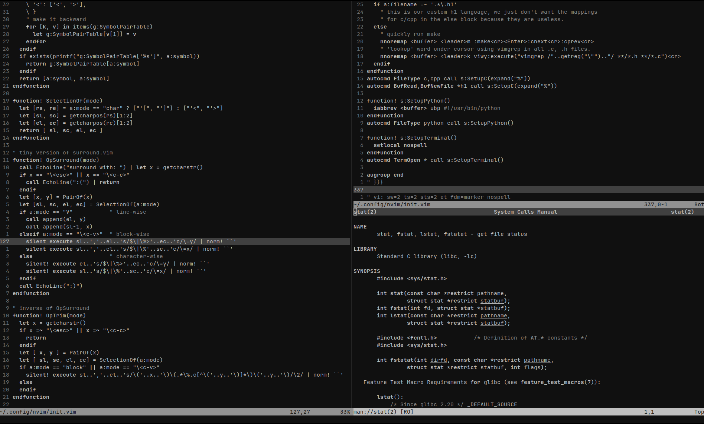

# Decoldest

> [!NOTE]
> The theme served me well, but I was getting tired of vimscript. An overhaul
> can be found at [mxi/vampire.nvim](https://github.com/mxi/vampire.nvim).

My tuned colorscheme for ultimate productivity.

I tried a lot of black/white/grayscale colorschemes. Most of them seemed to be
designed by CS:GO players because you need to flashbang gamma correct your eyes
to be able to see the contrast between different highlight groups (by far the
biggest problem being the comments which are damn near impossible to read with
a lot of schemes.)

